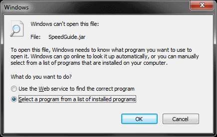
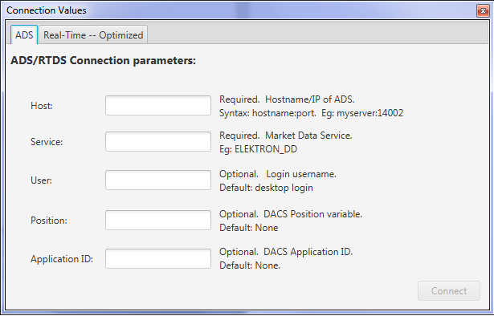
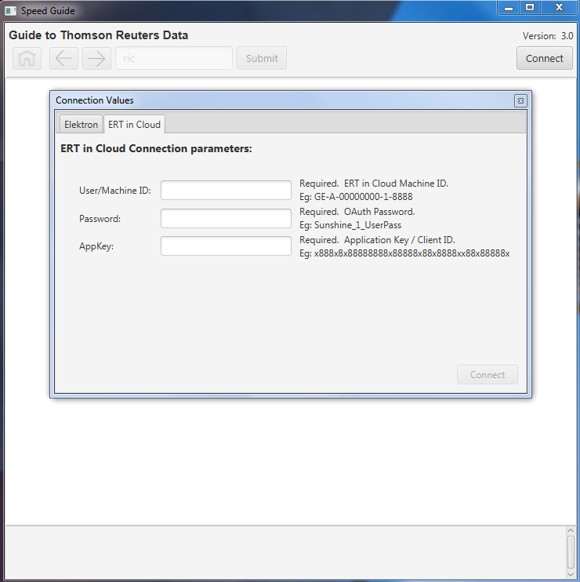
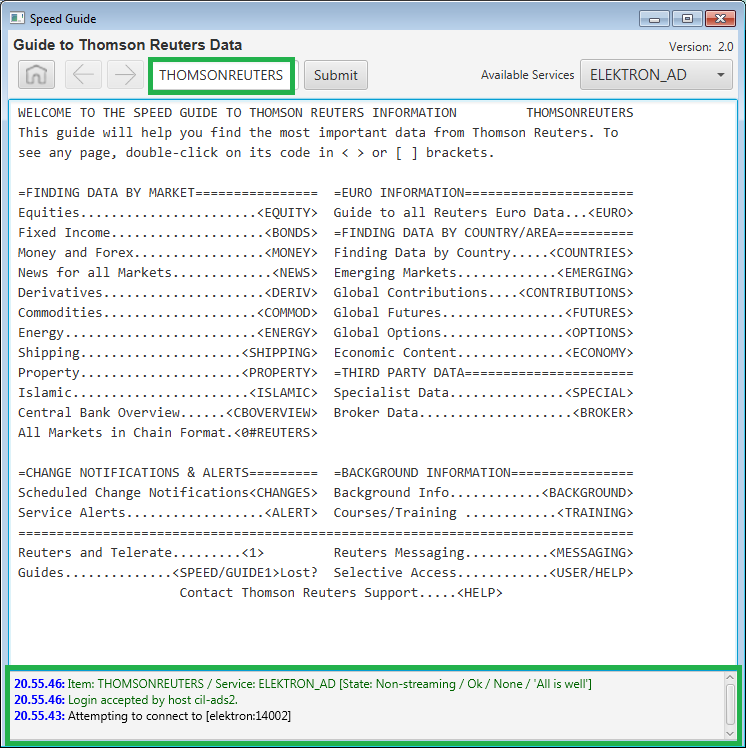
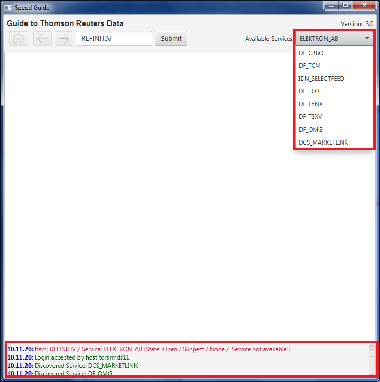
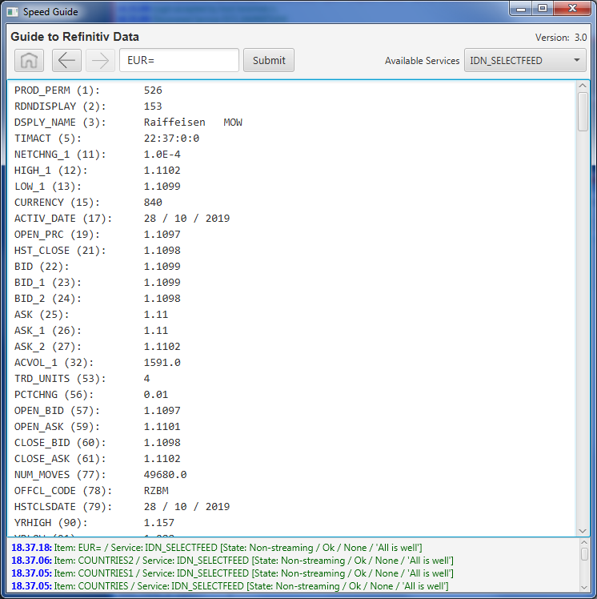
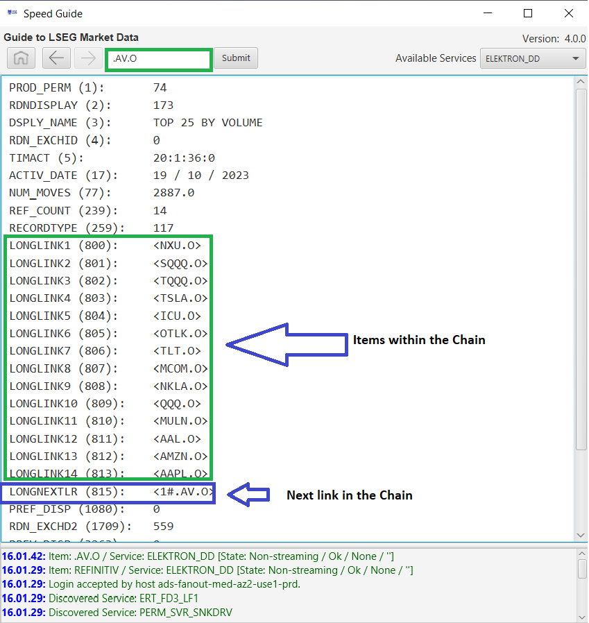

# Speed Guide
The Speed Guide utility allows users and developers, who do not have access to **Refinitiv Eikon**, a simple and quick way to easily browse the streaming services available within Refinitiv's Data Platform.  The following guide outlines the fundamental purpose of speed guides and provides basic instructions to use the utility.  In addition, outlines the components and instructions to build the tool using the source code available within this project.


# Overview

The Speed Guide utility allows users and developers who do not have access to the Eikon Desktop application to browse streaming content available from Refinitiv's Data Platform.  Streaming content can be accessed within ERT in Cloud or directly to your deployed Elektron services.

When building applications consuming streaming market data, developers often need a list of RICs (Reuters Instrument Codes) for certain market, exchange, or instrument types.  The list of fields provided for these instrument types will differ depending on the type of asset.  To aid in the discovery and understanding of these assets, the Speed Guide utility is a graphical tool presenting data screen displays.  These data screens, or ***speed guides***, help users navigate through the universe of RICs and list the fields available for the specific asset.  Developers will be presented with a simple organization of the data to gain a better understanding which includes complex structures such as Option Chains, Indices, Futures, etc.

The Speed Guide tool registers for Snapshot only data content (i.e, non-streaming).

## Utility download

The executable program and Readme is available for Download within the [Refinitiv Developer Platform](https://developers.refinitiv.com/system/files/SpeedGuide_2.0.zip).

## Running the Utility

The Speed Guide utility provides the ability to connect directly to the Refinitiv Data Platform, via ERT in Cloud or access through your deployed Elektron system/TREP (Thomson Reuters Enterprise Platform) service.

The package includes 2 components offering multiple ways to launch the tool.  Packaged are:

  * **SpeedGuide.jar**: An executable JAR available for Windows, Mac or Linux
  * **SpeedGuide.exe**: A convenient windows wrapper
### Launching the tool from the desktop (Windows):

Double-clicking either the _.jar_ or _.exe_ file will not pass any required connection parameters to the application.  However, users can create a shortcut on their desktop and apply parameters there - see [Command-line Options](#Command-line-options) below.

If the required parameters are not specified, the application will present a [Connection Dialog](#usage) requesting for the required connection details.  In either case, no console is involved thus no additional messages, such as log messages, can be viewed.

**Note**: Launching the executable JAR requires the [Javaw](https://docs.oracle.com/javase/7/docs/technotes/tools/windows/java.html) program to open it.  When not associated, you will be presented with a request such as:



You will need to choose the Javaw program within your Java installation.

### Launching the tool from the console

At the console, you can pass command-line parameters to the utility:

* #### Launching the executable JAR

  \> **java -jar SpeedGuide.jar [connection parameters]**
  
    When launching the executable JAR, users optionally specify command-line options and have the opportunity to see the output on the console.
	
* #### Launching the windows wrapper EXE
  
  \> **SpeedGuide.exe [options]**

    The windows wrapper is strictly a GUI based facility that does not have an explicit console attached.  Thus, no output can be viewed on the console.  However, users can capture the output within a file.  for example:
		
  \> **SpeedGuide.exe>output.txt [connection parameters]**
	
  
#### Command-line Options

    ************* Elektron Connection Parameters **************
    --host=hostname:port    Required. Elektron Server address/hostname and port of your Market Data
                            server. Syntax: <host/ip>:<port>.  Eg: elektron:14002 or 192.168.1.1:14002
    --service=serviceName   Required. Elektron Service Name providing market data content.
                            Eg: ELEKTRON_AD.
    --user=userName         Optional. DACS User name required if authentication is enabled on server.
                            Note: if no user name is provided, the utility will use your desktop login
    --appid=ApplicationId   Optional. DACS Application ID if authentication is enabled on server.
                            Application ID has no default.
    --position=Position     Optional. DACS Position if authentication is enabled on server.
                            Position has no default.
        
    ************* ERT in Cloud Connection Parameters **************
    --machineId=machine ID  Required. ERT in Cloud Machine ID/User required for OAuth authentication.
                            Eg: GE-A-00000000-1-8888
    --password=password     Required. ERT in Cloud password required for OAuth authentication.
                            Eg: Sunshine_1_UserPass
    --appKey=App Key        Required. ERT in Cloud AppKey or Client ID required for server
                            authentication. Eg: x888x8x88888888x88888x88x8888xx88x88888x
    --keyStore=keystorefile Optional. A Java KeyStore (JKS) required for secure package exchange.
                            Default: SpeedGuide provides a file for convenience.
    --keyStorePasswd=passwd Optional. Password associated with the specified keystore file.
                            Default: SpeedGuide includes the password for the default keystore file.
         
    --d[ebug]               Debug Mode.  Display verbose messages to the console
    --h[elp]                Prints this screen
The following example shows the command-line parameters to connect to either a deployed Elektron service or directly to ERT in Cloud.

    > SpeedGuide.exe --host=elektron:14002 --service=ELEKTRON_AD --user=testuser --appid=256 
                     --position=127.0.0.1
    > SpeedGuide.exe --machineId=GE-A-00000000-1-8888 --password=Sunshine_1_UserPass 
                     --appKey=x888x8x88888888x88888x88x8888xx88x88888x
## Usage

When launching the utility specifying insufficient command-line options, the user will be presented with a Connection dialog.  The user can choose how they want to access the platform, i.e. through their deployed Elektron services:



Or directory to ERT in Cloud over the Internet:



The _Status Pane_ at the bottom of the main window provides some general feedback, whether success or failure.  In the case where a successful connection can be made to your specified server, the utility will launch the root Speed Guide item, i.e. **THOMSONREUTERS**.

**Note**: While the utility will launch the "THOMSONREUTERS" RIC, which represents the root code of the Speed Guide pages, the utility is extremely useful for developers to visualize any other instrument available within Elektron.



### Buttons

The _Home_ button takes the user back to this page at any time.

To navigate through the guide, double click on any text nested between **< >** characters.  Although suggested within the guides, this utility does not presently support NEWS codes nested between **[ ]** characters.

The top navigation menu provides:

* A _Home_ button to go back to the initial main page.
* A _Previous_ button to go back to the previous page (if it exists).
* A _Next_ button to go to next page (if it exists).
* An input text field that displays the RIC for the current page, and allows entering a RIC to request.
* A _Connect_ button when no connection has been established
* An _Available Services_ drop-down providing the list of services available within the connected server

During normal operation, or possibly at startup, the _Status Pane_ will highlight issues appropriately.  In the case where the user specifies an incorrect service, the _Available Services_ drop-down will give them the opportunity to select a valid one.



### Data Navigation

As you navigate through the guide, double-clicking on \<**_nested items_**\>, you may be presented with a simple fieldlist display of the IDs, or Field IDs (FIDs) for a given RIC.

For example:



Although not presented in a user-friendly display form, the native list of fields not only provides the user the ability to research all available fields for a given asset, but also the opportunity to better understand the structure of Refinitiv Data. 

#### Chains

Navigating through the guide, you will likely come across some more complex data structures.  For example, some market data elements, such as the Nasdaq Top 25, are represented as a collection of elements, or also referred to as a **_Chain_**.  A _Chain_ contains a collection of elements represented within a preset number of underlying fields within a market data record.  In the case of the Nasdaq Top 25, the underlying elements represent the Top 25 trading equities.  Because a Chain is represented within a simple _MarketPrice_ structure containing a preset number of fields, the structure offers the ability to pull up the next link within this collection.

To demonstrate, we manually entered the Nasdaq Top 25 index _.AV.O_:



We can see from above, the record contains a preset number of elements (1-14) and the ability to pull up the next group of elements within the _next link_.  For a detailed outline of Chains, refer to the article: [Simple Chain Objects](https://developers.refinitiv.com/article/simple-chain-objects-ema-part-1) within the Developer Community.

Feel free to navigate through the guide to discover many other assets and data elements offered by Refinitiv.

# Solution Code

The utility was developed using the [Elektron SDK Java API](https://developers.refinitiv.com/elektron/elektron-sdk-java) and Java's GUI library Java 8 - JavaFx.

## Prerequisites

Required software components:

* [Elektron Message API](https://developers.refinitiv.com/elektron/elektron-sdk-java) (1.2 or greater) - Refinitiv interface to the Elektron Market Data environment.
* [JDK 8](http://www.oracle.com/technetwork/java/javase/downloads/jdk8-downloads-2133151.html) - Java Development Kit - version 8. 

Optional software components:

* [Eclipse](https://www.eclipse.org/efxclipse/install.html) - IDE for Java development (tested)
* Other IDE's such as: [NetBeans](https://netbeans.org/), [Intellij IDEA](https://www.jetbrains.com/idea/)
* [JavaFX Scene Builder](http://gluonhq.com/labs/scene-builder/) - UI to author JavaFX GUI-based applications
* [Ant](https://ant.apache.org/) - A command-line tool to compile and run the SpeedGuide utility 


## Building and running

This package includes an Ant build.xml file to build and execute the SpeedGuide utility.  The build.xml Ant file requires the following environment variables:

```
   JAVA_HOME          - Root directory of your JDK 8 environment
   ELEKTRON_JAVA_HOME - Root directory of your (EMA) Elektron Java API installation
```

Once setup, you can build and run the utility as follows:

```
To build:
> ant

To run:
> ant run
```


## Contributing

Please read [CONTRIBUTING.md](https://gist.github.com/PurpleBooth/b24679402957c63ec426) for details on our code of conduct, and the process for submitting pull requests to us.

## Authors

* **Susana Chang** - Release 1.1.  *Initial work*
* **Nick Zincone** - Release 2.0.  *Additional error checking/Utilized JavaFX Scene Builder to generate FXML*
* **Nick Zincone** - Release 2.1.  Added DACS fields required for login to Elektron.
* **Nick Zincone** - Release 3.0.  Added access to ERT in Cloud streaming services.

## License

This project is licensed under the MIT License - see the [LICENSE.md](LICENSE.md) file for details
