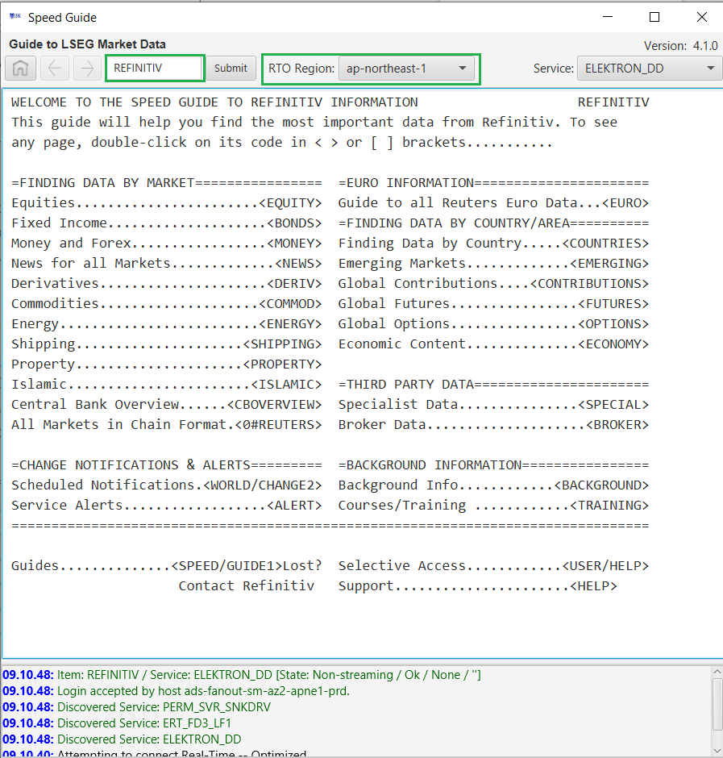
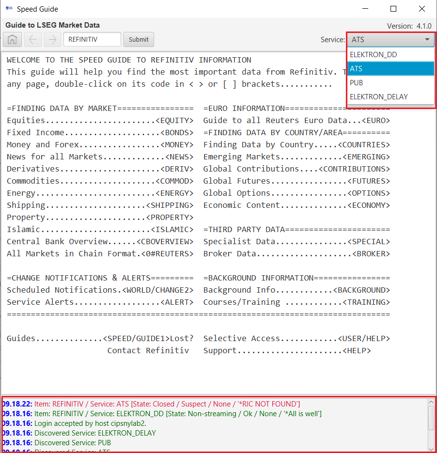
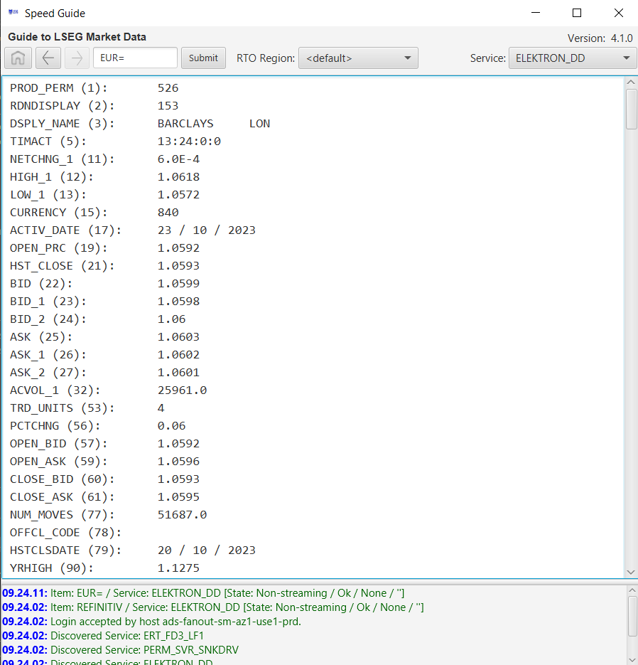

# Speed Guide
Created by Platform Services GitHub tool on Sun Jan 08 2017

The Speed Guide utility allows users and developers who do not have access to **Thomson Reuters Eikon** as a simple and quick way to easily 
browse the content available within the Thomeons Reuters Elektron service.

## Prerequisites

Required software components:

* [Elektron Message API](https://developers.thomsonreuters.com/elektron/elektron-sdk-java) - Thomson Reuters interface to the Elektron Market Data environment
* [JDK 8](http://www.oracle.com/technetwork/java/javase/downloads/jdk8-downloads-2133151.html) - Java Development Kit - version 8

Optional software components:

* [Eclipse](https://www.eclipse.org/efxclipse/install.html) - IDE for Java development (tested)
* Other IDE's such as: [NetBeans](https://netbeans.org/), [Intellij IDEA](https://www.jetbrains.com/idea/)
* [JavaFX Scene Builder](http://gluonhq.com/labs/scene-builder/) - UI to author JavaFX GUI-based applications


## Getting Started

This package includes some convenient files which will enable the developer to quickly build and run the Speed Guide utility.  To build and run, the package includes convenient scripts (**_build.bat_**, **_build.ksh_**, **_run.bat_**, **_run.ksh_**).  

Within each script contains:

```
The following batch file assumes the following environment:

   JAVA_HOME          - Root directory of your JDK 8 environment
   ELEKTRON_JAVA_HOME - Root directory of your (EMA) Elektron Java API installation
```

Once setup, you can build and run the utility.


# Overview

The Speed Guide utility allows users and developers who do not have access to the Eikon application to browse the contents available from Elektron.

When building Elektron Market Data consumers, developers often need a list of RICs (Reuters Instrument Codes) for a certain market, exchange, or instrument type. The Speed Guide 
utility is a tool to discover those RICs.  In addition, provides a simple way to easily navigate and provide a better understanding of the organization of the 
data which includes more complex structures such as Option Chains, Indices, etc.

The utility registers for Snapshot only data content (i.e, non-streaming).

## Utility download

The executable program and readme is available for Download within [TR Developer Platform](https://developers.thomsonreuters.com/system/files/SpeedGuideTool-20160816.zip).

## Running the Utility

The Speed Guide application must connect to an Elektron system/TREP (Thomson Reuters Enterprise Platform) or via Elektron Connect.

The package includes 2 components offering multiple ways to launch the tool.  Packaged are:

  * **SpeedGuide.jar**: An executable JAR available for both Windows and Linux
  * **SpeedGuide.exe**: A windows wrapper
	
### Launching the tool by double clicking on the icon:

Double-clicking either the _.jar_ or _.exe_ file will not pass any required parameters to the application.  As such, the application 
will present a [Connection Dialog](#Usage) requesting for these connection parameters.  In either case, no console is involved thus no 
additional messages, such as log messages, can be viewed.

### Launching the tool from the console:

At the console, you can pass command-line parameters to the utility:

* #### Launching the executable JAR

  \> **java -jar SpeedGuide.jar [options]**
    
    When launching the executable JAR, users optionally specify command-line options and have the opportunity to see the output on the console.
		
* #### Launching the windows wrapper EXE
  
  \> **SpeedGuide.exe [options]**

    The windows wrapper is strictly a GUI based facility that does not have an explicit console attached.  Thus, no output can be viewed on 
    the console.  However, users can capture the output within a file.  for example:
		
  \> **SpeedGuide.exe>output.txt [options]**
	
  
#### Command-line Options

    --host=hostname:port    Server address/hostname and port of your Market Data server.
                            Syntax: <host/ip>:<port>.  Eg: elektron:14002 or 192.168.1.1:14002
    --service=serviceName   Service Name providing market data content.
                            Eg: ELEKTRON_AD.
    --user=userName         User name required if authentication is enabled on server.
                            Note: if no user name is provided, the utility will use your desktop login
    --d[ebug]               Debug Mode.  Display verbose messages to the console
    --h[elp]                Prints the options screen
If neither the --host nor --service is provided, the utility will **prompt the user** to enter these values.

Example: \> **SpeedGuide --host=elektron:14002 --service=ELEKTRON_AD --user=testuser**

## <a name="usage"></a>Usage

When launching the utility specifying insufficient command-line options, the user will be presented with a Connection dialog:


The _Status Pane_ at the bottom of the main window provides some general feedback, whether success or failure.  In the case where a successful connection can be
made to your specified server, the utility will launch the root Speed Guide item, i.e. **THOMSONREUTERS**.



### Buttons

The _Home_ button takes the user back to this page at any time.

To navigate through the guide, double click on any text nested between **< >** characters.  Although suggested within the guides, this utility does
not presently support NEWS codes nested between **[ ]** characters.

The top navigation menu provides:

*   A _Home_ button to go back to the initial main page.
*   A _Previous_ button to go back to the previous page (if it exists).
*   A _Next_ button to go to next page (if it exists).
*   An input text field that displays the RIC for the current page, and allows entering a RIC to request.
*   A _Connect_ button when no connection has been established
*   An _Available Services_ dropdown providing the list of services available within the connected server

During normal operation, or possibly at startup, the _Status Pane_ will highlight issues appropriately.  In the case where the user specifies an incorrect
service, the _Available Services_ dropdown will give them the opportunity to select a valid one.



### Data Navigation

As you navigate through the guide, double-clicking on \<**_nested items_**\>, you may be presented with a simple fieldlist display of the IDs, or Field IDs (FIDs) for a given RIC.
For example:



Although not presented in a user-friendly display form, the native list of fields not only provides the user the ability to research all available fields for a given asset,
but also the opportunity to better understand the structure of Thomson Reuters Data. 

#### Chains

Navigating through the guide, you will likely come across some more complex structures.  For example, some market data elements, such as the Nasdaq Top 25, are represented as
a collection of elements, or also referred to as a **_Chain_**.  A _Chain_ contains a preset number of underlying elements belonging to that Chain.  In the case of the Nasdaq
Top 25, the underlying elements represent the Top 25 trading equities.  For Chains that exceed a preset size, the Chain also offers the ability to pull up the next link within
this collection.

To demonstrate, we manually entered the Nasdaq Top 25 index _.AV.O_:


Feel free to navigate through the guide to discover many other assets and data elements offered by Thomson Reuters.

# Solution Code

The utility was developed using the [Elektron SDK Java API](https://developers.thomsonreuters.com/elektron/elektron-sdk-java) and Java's GUI library Java 8 - JavaFx.


## Built With

* [Elektron Message API](https://developers.thomsonreuters.com/elektron/elektron-sdk-java)
* [JDK 8](http://www.oracle.com/technetwork/java/javase/downloads/jdk8-downloads-2133151.html)
* [Eclipse](https://www.eclipse.org/efxclipse/install.html) - IDE for Java development (tested)

## Contributing

Please read [CONTRIBUTING.md](https://gist.github.com/PurpleBooth/b24679402957c63ec426) for details on our code of conduct, and the process for submitting pull requests to us.

## Versioning

We use [SemVer](http://semver.org/) for versioning. For the versions available, see the [tags on this repository](https://github.com/your/project/tags). 

## Authors

* **Susana Chang** - Release 1.1.  *Initial work*
* **Nick Zincone** - Release 2.0.  *Additional error checking/Utilized JavaFX Scene Builder*

See also the list of [contributors](https://github.com/your/project/contributors) who participated in this project.

## License

This project is licensed under the MIT License - see the [LICENSE.md](LICENSE.md) file for details


